# Hi, I'm Ferrel

I like the messy part of building: turning a rough note into a screen, then into something with real data, handled edge cases, and a reason to exist.

## What I'm building

## Where I'm strong

* **AI tools with real inputs** — RAG, automation, and LLM flows that still behave after the demo stops being cute.
* **Web apps with a clear path** — one obvious main action, error states handled, not an afterthought.
* **Shipping** — small things that work, instead of demos that die in a README.

## Featured work

## GitHub

## Connect

*If it starts as a messy note and ends as a working app, I'm probably interested.*
