# Hi, I'm Ferrel

Informatics graduate from Yogyakarta, Indonesia. I build web apps and AI tools that survive real input — turning a rough note into a screen, then into something with actual data, handled edge cases, and a reason to exist.

 

<!-- Animated snake riding the contribution grid -->

---

## What I'm building

- **[rag-chatbot](https://github.com/ferrelganendra/rag-chatbot)** — production RAG QA engine: multi-model (Groq 70B, Gemini Flash, Llama 3.2), streaming, citations, built-in eval.
- **[jobradar-live](https://github.com/ferrelganendra/jobradar-live)** — job aggregator spanning 14 industries.
- **Puthic Sari** — storefront UI and product flow for a local buket business (private, client confidentiality).

---

## Where I'm strong

- **AI tools with real inputs** — RAG, automation, and LLM flows that still behave after the demo stops being cute.
- **Web apps with a clear path** — one obvious main action, error states handled, not an afterthought.
- **Shipping** — small things that work, instead of demos that die in a README.

---

## The stack

Also reach for: Java, PHP, Vue, Node.js, PyTorch, Docker, Figma.

---

## GitHub

<!-- Custom dark 3D GitBlock contribution graphic (generated by workflow) -->

<!-- Custom info panel (dark, own design, not a template card) -->
 

---

## Now playing

---

**Let's build something.** · [LinkedIn](https://linkedin.com/in/ferrelganendra) · [portfolio](https://ferrelganendra.my.id)

*If it starts as a messy note and ends as a working app, I'm probably interested.*

